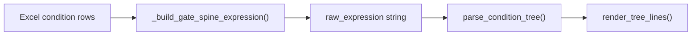
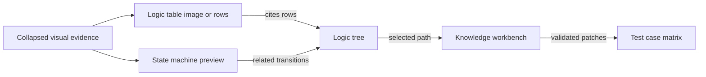

# ALEX Upgrade Plan: M365 Copilot Co-Reasoning for Complex Customer Logic

**Status:** Build in progress (v0.3 → v0.5) · Library (Tab 4) reworked into a Polarion-style focus + spokes canvas 2026-05-20  
**Audience:** Product / engineering owners, automotive test-spec engineers  
**Language:** English  
**Last updated:** 2026-05-20

---

## 1. Executive summary

ALEX today is strong at **evidence extraction** (tables, footnotes, trace rows, issues) on **simple sample specs**. Real customer system specifications are different:

- Nested AND/OR across merged cells, continuation rows, and cross-references
- Logic split across Word, Excel, PDF diagrams, timing charts, and inline Japanese glosses
- Implicit definitions (“as defined in section 3.2”), signal aliases, and state-dependent semantics
- Design intent that requires **reading**, not **pattern matching**

Pure Python parsers and semantic search cannot safely close this gap. Without a **reasoning partner**, ALEX becomes a formatter — useful for demos, insufficient for production customer documents.

**Strategic direction:** Keep the deterministic core as the **evidence and safety engine**. Add **Microsoft 365 Copilot** as a **co-reasoning layer** inside the review loop — not as a replacement for structure, but as the interpreter of ambiguous design when evidence is incomplete.

**Goal:** An engineer works **one logic group at a time** in ALEX; Copilot proposes **hypotheses** (definitions, path readings, diagram narratives); ALEX **validates, stores, and gates export** until hypotheses are accepted or overridden.

---

## 2. Problem statement (why samples mislead us)

| Dimension | Current samples (`Shutoff`, `GPT_GenLogic`) | Typical customer spec |
|-----------|---------------------------------------------|------------------------|
| Table shape | Regular two-column grids | Merged regions, multi-page continuations, footnote chains |
| Logic depth | 1–3 levels AND/OR | Deep trees + cross-control dependencies |
| Definitions | Inline or missing | Glossary sections, external sheets, “see diagram” |
| Diagrams | Optional PNG | State machines, timing, wiring — often **authoritative** |
| Language | Mostly EN | JP customer text + EN signal names |
| Failure mode | `partial` + issues | Same, but **volume** of gaps blocks all export |

**Conclusion:** Scaling parser heuristics alone has diminishing returns. The product must assume **permanent partial parse** on hard controls and offer a **guided reasoning path** to close gaps with Copilot + human sign-off.

---

## 3. Design principles (non-negotiable)

1. **Deterministic core, probabilistic assist** — Parsers own row paths, issue IDs, and export gates; Copilot owns interpretation drafts.
2. **Fail closed** — No silent promotion of LLM output to `parse_status: ok` or export-ready rows.
3. **Evidence-first prompts** — Every Copilot call receives the same frozen **brief** ALEX already built (`m365_brief.py`): table excerpt, tree, issues, candidates, engineer note.
4. **Hypothesis, not truth** — Copilot output is stored as `reasoning_hypothesis` with `review_required: true`, `source: m365_copilot`.
5. **Human sign-off in UI** — Engineer accepts, edits, or rejects; optional “apply to overlay” never bypasses validation (`knowledge_validation.py`).
6. **One control, one session** — Reasoning is scoped to `logic_id` to control cost, latency, and auditability.
7. **IT-light by default** — Prefer flows the engineer can complete without tenant admin; document admin path only when required.

---

## 4. Can we log in like GitHub Copilot?

**Short answer:** The **UX can be similar**; the **platform requirements are not identical**.

### 4.1 How GitHub Copilot CLI login works (today in ALEX)

| Aspect | GitHub Copilot CLI |
|--------|-------------------|
| Mechanism | OAuth **device code** flow |
| User steps | Open `github.com/login/device`, enter one-time code |
| App registration | **None** for the engineer — GitHub owns the client |
| License | GitHub Copilot subscription tied to the GitHub account |
| API | CLI subprocess; not a stable public “Copilot chat” REST API for apps |

ALEX already implements this pattern in `web/copilot_bridge.py` (device URL + code parsing).

### 4.2 How M365 Copilot login works (today in ALEX)

| Aspect | M365 Copilot (Graph `/copilot/conversations`) |
|--------|-----------------------------------------------|
| Mechanism | OAuth **device code** flow (same *shape* as GitHub) |
| User steps | Open `microsoft.com/devicelogin`, enter code, sign in with work/school account |
| App registration | **Required** — Azure **Application (client) ID** (`web/m365_auth.py`) |
| License | M365 Copilot license on the signed-in user |
| API | Microsoft Graph beta — programmatic chat from ALEX |

So: **Yes, login feels like GitHub Copilot** (code + browser). **No, there is no official “zero Client ID” login** for third-party apps calling M365 Copilot Chat API. Microsoft does not publish a first-party public client ID for arbitrary desktop tools the way GitHub does for `@github/copilot`.

### 4.3 What we cannot promise

- A single “Sign in with Microsoft” button with **zero** Azure setup for **all** tenants (enterprise often blocks user-created app registrations).
- Using **personal** `@outlook.com` accounts for M365 Copilot API (not supported for production Copilot scenarios).
- Replacing M365 Copilot with GitHub Copilot for **M365-licensed enterprise reasoning** — different products, different data boundaries.

### 4.4 What we *can* promise (IT-light paths)

See Section 6 for the full tiered strategy. Summary:

| Tier | Who sets up Client ID | Admin consent | Best for |
|------|----------------------|---------------|----------|
| **A — Self-serve** | Engineer (free Azure / M365 Dev Program) | Usually none (delegated user consent) | Individual engineers, pilots |
| **B — Loopback PKCE** | Same as A, better UX than device code | Same | Desktop ALEX app |
| **C — BYO token** | Optional | None if user already signed in elsewhere | Power users (`az login`, VS Code) |
| **D — Enterprise** | IT publishes one tenant app | One-time admin consent | Production rollout |

**Recommendation:** Ship **Tier A + B** as default; keep **Tier C** as escape hatch; document **Tier D** for customer IT without blocking pilots.

### 4.5 Account compatibility (who can use what)

| Account | M365 Copilot in ALEX | GitHub Copilot in ALEX |
|---------|----------------------|-------------------------|
| Company email (tenant blocks apps) | Usually blocked | Works if org allows Copilot CLI |
| Personal @outlook.com / Gmail only | **Not supported** for M365 API | GitHub account (Gmail signup OK) + Copilot subscription |
| **M365 Developer Program sandbox** | **Recommended pilot path** — see setup guide below | Same machine; use as fallback |

**Resolve with AI (target):** User selects provider in Knowledge workbench — **M365 Copilot** | **GitHub Copilot CLI** | **Ollama** — same reasoning + test-case update job.

### 4.6 Azure app registration (when Dev Program sandbox unavailable)

If you created an app in [portal.azure.com](https://portal.azure.com) (e.g. **ALEX_AI_TMC**):

1. **Authentication** → **Allow public client flows** = **Yes**
2. **API permissions** → Microsoft Graph → Delegated → **User.Read** (+ Copilot scopes if shown) → **Grant admin consent**
3. Copy **Application (client) ID** and **Directory (tenant) ID** from Overview
4. ALEX **Review** tab → paste Client ID (+ Tenant ID if not using `common`) → **Save** → **Sign in**
5. Sign in at device login with the **same Microsoft account** that owns the Azure subscription

**Client secret:** not needed for ALEX device-code flow.

**Copilot chat API:** may return 403 without M365 Copilot license — use **GitHub Copilot** from provider selector for reasoning.

Dev Program sandbox guide (often blocked): **[M365_DEV_PROGRAM_SETUP.md](M365_DEV_PROGRAM_SETUP.md)**

---

## 5. Target architecture: Evidence engine + Reasoning layer

```
┌──────────────────────────────────────────────────────────────────────┐
│  LAYER 1 — Deterministic evidence (existing, expand tests)             │
│  pipeline.py → parsers → AST (best effort) → issues → ui_bundle      │
│  Output: logic_blocks, condition_trees, evidence_registry, gaps      │
└───────────────────────────────┬──────────────────────────────────────┘
                                │ frozen brief per logic_id
                                ▼
┌──────────────────────────────────────────────────────────────────────┐
│  LAYER 2 — Co-reasoning orchestrator (NEW)                           │
│  reasoning_session.py                                                │
│  • Build brief + gap questions                                       │
│  • Call M365 Copilot (multi-turn, capped)                            │
│  • Parse structured hypotheses (JSON schema)                         │
│  • Run knowledge_validation + logic_compliance                       │
│  • Never write directly to final AST                                 │
└───────────────────────────────┬──────────────────────────────────────┘
                                │ hypotheses + patches (review_required)
                                ▼
┌──────────────────────────────────────────────────────────────────────┐
│  LAYER 3 — Engineer review UI (extend Logic & Definitions)         │
│  • Side-by-side: Spec excerpt | Tree | Raw expression | Copilot note │
│  • Accept / edit / reject hypothesis per field                       │
│  • Attach files → re-run evidence bind                               │
│  • Export gate reads accepted overlays only                          │
└──────────────────────────────────────────────────────────────────────┘
```

### 5.1 Division of responsibility

| Task | Python / deterministic | M365 Copilot |
|------|------------------------|--------------|
| Detect table rows, indentation, footnotes | ✅ | — |
| Build initial AND/OR AST when grid is unambiguous | ✅ | — |
| Explain *why* parse is `partial` / `failed` | Issue text only | ✅ Plain language + cited rows |
| Resolve missing definition (“ADM_IDLE means…”) | Block until defined | ✅ Propose definition from spec prose |
| Read diagram / timing intent | OCR text only | ✅ Narrative states/transitions (unverified) |
| Disambiguate merged-cell OR groups | Flag issue | ✅ Propose grouping hypothesis |
| Draft Given/Then for candidates | Template only | ✅ Boundary values + path alignment |
| Final export row | After validation | ❌ Never auto-final |

### 5.2 Reasoning session object (new contract)

Stored under `ui_bundle.yaml` → `reasoning_sessions[]`:

```yaml
- session_id: RS_20260519_LB042_a1b2
  logic_id: LB042
  provider: m365
  status: open | awaiting_engineer | closed
  turns:
    - role: system
      brief_hash: sha256:...
    - role: copilot
      hypothesis:
        definition_updates: [...]
        tree_interpretation: "..."   # narrative only
        candidate_patches: [...]
        open_questions: [...]
        citations: [{ file, locator, excerpt }]
      review_required: true
  engineer_decision: accept | reject | partial
  applied_overlay_ids: []
```

**Rule:** `tree_interpretation` never overwrites `logic_blocks[].ast` without a separate, explicit engineer action (“Promote to draft AST”) in a later phase — if ever.

---

## 6. Authentication strategy (minimize IT dependency)

### Tier A — Engineer self-registration (current + polish)

**Already implemented:** paste Client ID in Review login hub; device code login; token in `web_data/m365/` (gitignored).

**Upgrade tasks:**

| # | Task | IT needed? |
|---|------|------------|
| A1 | In-app wizard: “Create Azure app in 5 steps” with screenshots + copy-paste GUID validator | No |
| A2 | Default scopes minimal set for Copilot chat only (trim `DEFAULT_SCOPES` to what Graph actually requires) | No |
| A3 | Detect common errors (`Needs Client ID`, wrong tenant) with recovery actions | No |
| A4 | M365 Developer Program link + free sandbox tenant instructions | No |

**Azure app checklist (engineer self-serve):**

1. [Azure Portal](https://portal.azure.com) → App registrations → New registration  
2. Name: `ALEX-local` (any name)  
3. Supported accounts: **Multitenant + personal Microsoft** *or* single tenant per org policy  
4. Authentication → **Allow public client flows** = Yes  
5. API permissions → delegated **Microsoft Graph** permissions required for Copilot chat (follow current Graph beta docs; validate at implementation time)  
6. Copy **Application (client) ID** into ALEX  
7. Sign in via device code with work account that has **Copilot license**

### Tier B — Loopback PKCE (GitHub-desktop-like UX)

Replace device code with **localhost redirect** (`http://127.0.0.1:8766/oauth/callback`) using MSAL:

- One click “Sign in with Microsoft” opens browser; returns to ALEX automatically  
- Still requires Client ID from Tier A, but **better UX** than typing device codes  
- Same IT footprint as Tier A

### Tier C — Bring-your-own-token (no new app for some users)

Optional advanced path:

| Source | Use case |
|--------|----------|
| Azure CLI (`az account get-access-token --resource https://graph.microsoft.com`) | Engineers already using Azure |
| VS Code / Azure Account extension session | Same machine as IDE |
| Manual paste access token (short-lived) | Debugging only |

ALEX validates token via `GET /me` and uses it for Copilot calls. **No refresh** — user re-authenticates when expired. Zero app registration if org provides tokens another way (rare).

### Tier D — Enterprise (when self-serve is blocked)

| # | Task | Owner |
|---|------|-------|
| D1 | Publish `docs/IT_ADMIN_M365_SETUP.md`: one app, admin consent, optional conditional access notes | ALEX team |
| D2 | Support **single-tenant** `tenant_id` + pre-configured `client_id` via `config.yaml` or MSI for hosted ALEX | IT |
| D3 | Optional: Copilot Studio agent / Teams tab embedding (future) | IT + ALEX |

**Policy reality:** Many automotive tenants **disable user app registration**. Tier D is required for production there; Tiers A–C unblock development and pilots.

### Dual-provider fallback (not a replacement for M365)

| Provider | Role |
|----------|------|
| **M365 Copilot** | Primary reasoning — enterprise spec context, Copilot license |
| **GitHub Copilot CLI** | Secondary — IDE-adjacent brief paste, no Graph API; enable when M365 unavailable |
| **Ollama** | Translation / offline experiments only — **not** complex logic reasoning |

Config already has `assist.copilot.enabled: false`; plan to re-enable as **brief export + optional CLI assist**, not as primary reasoning API.

---

## 7. Co-reasoning workflows (UI)

### 7.1 Logic group — “Reason with Copilot” (extend Resolve with AI)

**Trigger:** User selects logic group with `parse_status != ok` or unresolved definitions.

**Steps:**

1. ALEX shows **gap summary** (deterministic): missing terms, failed rows, unresolved refs.  
2. Engineer adds **note** + optional **attachments** (already supported).  
3. **Reason with Copilot** sends brief → M365 → structured hypothesis JSON.  
4. UI renders hypothesis sections:
   - Proposed definitions (accept one-by-one)
   - Open questions (must answer or dismiss)
   - Candidate Given/Then drafts (preview in workbook overlay)
5. **Apply selected** runs validation pipeline; failures trigger **one auto-retry** with failure context (existing `validation_retries`).  
6. Session closes when engineer marks **Resolved enough to continue** or **Blocked — need customer clarification**.

### 7.2 Diagram / cross-document reasoning

For controls linked to diagram evidence:

1. ALEX sends OCR text + shape list + nearby spec paragraphs (not raw image to Graph unless later approved).  
2. Copilot returns `diagram_hypothesis` (states, transitions, open questions).  
3. Engineer maps hypothesis to existing `state_machine.yaml` rows manually or via future linking UI.  
4. No automatic merge into state machine without sign-off.

### 7.3 Export gate

Export remains blocked when:

- Blocking deterministic issues unresolved **and** no accepted overlay covers the gap  
- Copilot hypothesis pending review for required fields (configurable strictness)

### 7.4 Compact evidence citations (GPT_GenLogic / multi-row specs)

**Problem (observed on `GPT_GenLogic.xlsx` › `Test_Power_State_Spec`):** Definition and trace panels repeat the full locator on every line:

```
spec_definition · GPT_GenLogic.xlsx / Test_Power_State_Spec / row 24
Refer to lower condition group
spec_definition · GPT_GenLogic.xlsx / Test_Power_State_Spec / row 43
Composite condition group (AND)
spec_definition · GPT_GenLogic.xlsx / Test_Power_State_Spec / row 44
AND
spec_definition · GPT_GenLogic.xlsx / Test_Power_State_Spec / row 45
PWR_REQ = 1
spec_definition · GPT_GenLogic.xlsx / Test_Power_State_Spec / row 46
T_REQ_STABLE elapsed
```

Citations are **required for audit and Copilot briefs** — but the UI must not render them as N full-width blocks when file + sheet are identical.

**Design — keep data, compress presentation:**

| Layer | Rule |
|-------|------|
| **Storage / brief** | Unchanged — every row keeps full `source` object (`kind`, `file`, `sheet`, `row`, text) |
| **UI default** | **Group by anchor** `{file, sheet}` once; list rows as compact lines |
| **Chip label** | Short: `r43` or `¶12` — full locator in `title` / click-to-copy |
| **Kind prefix** | Omit repeated `spec_definition` when all items share kind; use icon or section label |
| **Composite logic** | Prefer indented tree (`AND` / `OR` / leaf) over flat duplicate headers |
| **Expand** | `<details>` “All locators (N)” for export/debug; collapsed by default |

**Target compact view (same information):**

```
GPT_GenLogic.xlsx › Test_Power_State_Spec          [4 rows · spec_definition]
  r24   Refer to lower condition group
  r43   Composite condition group (AND)
  r44   AND
  r45   PWR_REQ = 1
  r46   T_REQ_STABLE elapsed
```

**Where to apply:** Definition inbox (`renderDefinitionInbox`), trace table Sources column, logic compare panel footnotes — reuse one helper `groupEvidenceByAnchor()` in `app.js`.

**Non-goals:** Do not drop row numbers from stored evidence or M365 brief; compression is display-only.

### 7.5 Raw expression vs Tree logic — why “simple” spec still shows `opaque`

**Observed (e.g. shutoff / power-state control from `GPT_GenLogic.xlsx`):**

| Panel | What engineer sees |
|-------|-------------------|
| **Raw expression (from spec)** | `(PWR_REQ_VALID AND VEHICLE_SAFE AND (NORMAL_ROUTE OR (BACKUP_ROUTE AND T_SHUT_CONFIRM elapsed)) AND NOT NOK_SHUTOFF)` — readable boolean structure |
| **Tree logic** | `AND` → mostly **`opaque`**, one **`timing_condition`** |
| **Footnote** | *Expression recovered from Excel gate spine; inner timing/value clauses may still need review.* |

**This is not an AI understanding failure.** Raw and tree come from **two different deterministic steps**:



1. **Gate spine (Excel)** — stacks row tokens (`AND`, `OR`, signal names, `elapsed`) into a **parenthesized string**. That step works well on two-column / gate-spine tables → raw looks “simple”.
2. **Condition tree parser** (`condition_tree_builder._parse_atom`) — classifies each leaf only if it matches:
   - `signal == value` / `!=` / `>` … → `signal_condition`
   - text with `elapsed` / `timeout` / `ms` → `timing_condition`
   - `Condition_*` reference → `reference`
   - **everything else → `opaque`**
3. **Boolean predicates without operators** — automotive flags like `PWR_REQ_VALID`, `VEHICLE_SAFE`, `NORMAL_ROUTE`, `BACKUP_ROUTE`, `NOK_SHUTOFF` are **valid logic** (implicit “true / active”) but have **no `=` or `==`**, so they become **`opaque`** even though the raw string is correct.
4. **Tree renderer gap** — `render_tree_lines()` labels nodes with `type` (`opaque`) instead of **`raw_text`**, so the UI hides the actual signal names (engineer sees four identical `opaque` lines).
5. **Misleading `parse_status`** — Excel two-column path sets block `parse_status: ok` when a string was built, even when inner AST leaves are opaque (`parse_status: partial` on nodes). UI badge “parse ok” overstates confidence.

**Why Copilot / M365 is not the first fix here:**

| Approach | Fit |
|----------|-----|
| **Deterministic parser upgrade** | ✅ Add `boolean_predicate` (or `signal_flag`) atom for `[A-Z][A-Z0-9_]+` leaves; show `raw_text` in tree |
| **Indentation / row-path AST** | Use `row_paths` from gate spine where available instead of re-parsing string |
| **M365 co-reasoning** | For **ambiguous** merged cells, footnotes, cross-refs — not for replacing a fixable boolean parse |
| **More Excel heuristics alone** | Gate spine already produced good raw text; bottleneck is **atom classifier + tree display** |

**Target behavior (same control):**

```
AND
├── PWR_REQ_VALID          (boolean_predicate)
├── VEHICLE_SAFE           (boolean_predicate)
├── OR
│   ├── NORMAL_ROUTE       (boolean_predicate)
│   └── AND
│       ├── BACKUP_ROUTE   (boolean_predicate)
│       └── T_SHUT_CONFIRM elapsed  (timing_condition)
└── NOT NOK_SHUTOFF        (boolean_predicate)
```

**Honest UI labels until fixed:**

- `parse_status`: **`partial`** when any child is `opaque` or `reference` unresolved
- Tree line: show **`raw_text`**, not type name
- Gate note: distinguish “string recovered” vs “structure fully parsed”

### 7.6 Logic workspace must be evidence-connected

**Problem:** Logic Tree by itself is not enough for real customer specs. Engineers sometimes need to see the original logic table image/snippet or detected state-machine context **beside the tree** to judge whether ALEX or Copilot interpreted the spec correctly. But this must not consume space by default.

**Target UI for each logic group:**



**Rules:**

| Area | Requirement |
|------|-------------|
| Logic Tree | Show parsed AND/OR/NOT tree with leaf labels and per-node confidence/status |
| Visual evidence default | **Collapsed by default** beside the Logic Tree: button/chip like `Show source table` / `Show state context`; never auto-expand on page load |
| Logic table | Prefer the **cropped original table image/snippet** when available (like the Word table screenshot), with compact row fallback grouped by file/sheet; clicking row or crop region highlights tree node |
| State machine | If states/transitions are detected near the same source region/control, expose a collapsed **Related state context** panel with `from → to`, event, condition, and evidence |
| Layout | Use split view only when expanded: Tree stays primary; visual evidence opens in side drawer / right panel / below-on-small-screen |
| Copilot update | Knowledge workbench should send the selected tree node + nearby source rows + related state transitions; visual crop path/image metadata is attached only when supported |
| Human editing | Engineer can use table/state context to decide whether to accept AI patch, edit note, or mark blocked |

**Default compact UI:**

```
Logic structure
[Tree logic]                         [Show source table] [Show state context]
AND
├── CND_REQ_GROUP = 1
├── CND_SAFE_GROUP = 1
└── OR ...
```

Only when the engineer clicks:

```
Right evidence drawer
  Source table crop: edited_Shutoff_Condition_Spec.docx / OK_SHUTOFF table
  Related rows: r24, r43-r46
  Related state context: stateA -> stateB (if detected)
```

**Example:** For `OK_SHUTOFF`, keep the tree visible and attach the original Word logic table as a collapsed source-table preview. When opened, the engineer sees the table image/snippet with `AND`, nested `OR`, `CND_REQ_GROUP = 1`, `CND_SAFE_GROUP = 1`, backup timer, `POWER = OFF`, and output ready. If a state-machine edge references the same control or nearby source rows, show it in the same drawer as `stateA → stateB`, so the engineer can ask Copilot to update test cases with both logic and transition context.

### 7.7 AI hallucination controls (stronger than “review required”)

Copilot/M365/GitHub may still produce plausible but wrong logic. The plan must reduce hallucination before it reaches test cases:

| Control | Implementation requirement |
|---------|----------------------------|
| Evidence budget | Every prompt includes **only scoped evidence**: selected logic group, compact source rows, related definitions, related transitions, current test cases |
| Citation coverage | Every proposed definition, condition, transition, and testcase patch must cite at least one locator (`file/sheet/row`, paragraph, diagram asset) |
| Unsupported claim handling | If Copilot cannot cite evidence, output `open_questions` instead of a patch |
| Schema hardening | Hypothesis schema separates `claims`, `citations`, `open_questions`, `testcase_patch_plan`; no free-form answer becomes executable |
| Validation | Reject patches without cited signals/rows, wrong candidate id, missing path alignment, or pass/fail intent mismatch |
| Diff review | UI shows before/after testcase changes and “why” before apply |
| Audit | Persist model/provider, prompt hash, evidence hash, accepted/rejected status, engineer id/time |

### 7.8 Scale target: few hundred test cases

The target tool is not a demo for 10 cases; it must stay usable around **100–300 test cases**.

**UI scale requirements:**

| Area | Requirement |
|------|-------------|
| Logic tab | Show per-logic subset first; avoid rendering all testcase cards at once |
| Workbook | Virtualized/compact table for 100–300 rows; sticky headers; column resize; focused row editor |
| Reconciliation | Batch patch preview grouped by action: update existing, add new, retire, needs review |
| Navigation | Path × testcase matrix: rows = logic paths/branches, columns/cards = affected TCs |
| Filtering | Filter by blocked, updated by AI, needs engineer answer, logic group, provider |
| Performance | Avoid re-rendering full workbook after every edit; update affected row/group only where practical |

---

## 8. Phased roadmap

### Phase 0 — Foundation (current sprint, ~1 week)

| Deliverable | Notes |
|-------------|-------|
| Document this plan | ✅ `docs/ALEX_M365_REASONING_UPGRADE_PLAN.md` |
| Stabilize M365 device login + status polling | ✅ Done |
| **Provider selector + unified Resolve with AI** | ✅ M365 / GitHub Copilot CLI / Ollama / Auto |
| **GitHub Copilot knowledge apply** | ✅ `apply_knowledge_via_copilot` + router fallback |
| Complex fixture spec (synthetic “hard” doc) | New sample under `pm_sample_inputs/` |
| Metrics: `% controls ok vs partial vs failed` on hard fixture | Baseline scoreboard |

### Phase 1 — Reasoning session core (~2–3 weeks)

| # | Work item |
|---|-----------|
| 1.1 | `web/reasoning_session.py` — create/load/append turns, brief hashing |
| 1.2 | JSON schema for hypotheses (`schemas/reasoning_hypothesis.schema.json`) |
| 1.3 | API: `POST /api/reasoning/start`, `POST /api/reasoning/continue`, `GET /api/reasoning/{logic_id}` |
| 1.4 | Extend `apply_knowledge_via_m365` → multi-turn with `open_questions` loop (max 3 turns) |
| 1.5 | Persist sessions in `ui_bundle.yaml` + job folder `reasoning/` |
| 1.6 | UI: hypothesis review panel (accept/reject per patch) |
| 1.7 | **Compact evidence citations** — group `spec_definition` by file/sheet; short `rN` chips; full locator on hover / in brief only (§7.4; GPT_GenLogic fixture) |
| 1.8 | **Boolean predicate AST + tree display** — `boolean_predicate` atoms; tree shows `raw_text`; honest `partial` when opaque remains (§7.5; shutoff / PWR_REQ_VALID fixture) |
| 1.9 | **Evidence-connected logic workspace** — tree + source table + related state-machine context next to each other (§7.6) |
| 1.10 | **Hallucination guardrails** — citation coverage, unsupported-claim → open question, prompt/evidence hashes (§7.7). Base schema/API implemented: `schemas/reasoning_hypothesis.schema.json`, `/api/reasoning/hypothesis` |
| 1.11 | Tests: mock Graph responses; compliance validation unchanged |

### Phase 2 — IT-light auth UX (~2 weeks)

| # | Work item |
|---|-----------|
| 2.1 | In-app Azure setup wizard (Tier A) |
| 2.2 | MSAL loopback PKCE login (Tier B) alongside device code |
| 2.3 | Optional BYO token field (Tier C, advanced settings) |
| 2.4 | `docs/IT_ADMIN_M365_SETUP.md` for Tier D |
| 2.5 | Scope audit — request minimum Graph permissions |

### Phase 3 — Complex-spec hardening (~3–4 weeks)

| # | Work item |
|---|-----------|
| 3.1 | Hard customer-like sample pack + golden `ui_bundle` expectations (`GPT_GenLogic.xlsx` / `Test_Power_State_Spec` as compact-evidence golden) |
| 3.2 | Gap-driven prompt templates per issue type (`ERR_REF_*`, `partial`, diagram) |
| 3.3 | Diagram co-reasoning path (OCR + Copilot narrative) |
| 3.4 | GitHub Copilot CLI brief export re-enabled as fallback |
| 3.5 | Reasoning cost/latency limits (token budget per session) |
| 3.6 | **Few-hundred testcase UI** — virtual/compact workbook, path × testcase matrix, batch patch preview (§7.8) |
| 3.7 | **Test Case Reconciliation** — update/retire/add/needs-review plan, not add-only generation. Foundation implemented in `src/engine/testcase_reconciliation.py`; summaries are saved with each knowledge apply |

### Phase 4 — Production enterprise (~ongoing)

| # | Work item |
|---|-----------|
| 4.1 | Hosted ALEX with IT-provided app registration |
| 4.2 | Audit log export (who accepted which hypothesis) |
| 4.3 | Optional Copilot Studio / Teams integration |
| 4.4 | Customer Excel template mapping with reasoning-assisted column fill |

---

## 9. Prompt and safety upgrades

Extend `docs/COPILOT_PROMPTS.md` with **issue-type templates**:

| Issue type | Copilot task |
|------------|--------------|
| `unresolved_condition` | Find definition in attached spec sections; propose `definition_updates` |
| `parse_partial` | Explain ambiguous rows; propose **narrative** grouping; do not emit AST |
| `diagram_only` | Propose states/transitions from OCR; list open questions |
| `cross_reference` | Trace “see sheet X” references; cite locators · Tab 4 is now a **Polarion-style focus + spokes canvas**: engineers pick a local library folder, set a focus item, and build trace rows with free-form labels (`Satisfies`, `Validated By`, `Implemented By`, …). Each slot accepts OS drag-drops (file is copied into the library folder) or click-to-pick from the local tree; `+` adds slots to a row, `+ Add relationship` adds a new row. No notes, no preview, no sidebar — the canvas is the whole tab. `document_graph_builder` still runs during analyze and persists auto-detected file links in the bundle as background evidence for AI co-reasoning, but it no longer drives a dedicated UI tab |
| `candidate_blocked` | Draft Given/Then aligned to logic path + engineer note |

**Global system instruction (all calls):**

> You are co-reasoning with ALEX. Cite evidence locators for every claim. Output JSON matching the schema. If evidence is insufficient, add `open_questions` instead of guessing. Never assert final AND/OR structure unless quoting explicit table indentation described in the brief.

---

## 10. Risks and mitigations

| Risk | Impact | Mitigation |
|------|--------|------------|
| Tenant blocks user app registration | M365 path unusable | Tier C/D docs; GitHub Copilot brief fallback |
| Graph Copilot API beta changes | Broken chat | Version pin docs; abstraction in `m365_copilot.py` |
| Copilot hallucination on complex logic | Wrong tests shipped | Citation coverage, unsupported claims become `open_questions`, schema validation, diff review, audit log |
| Parser under-classifies simple flags (`opaque`) | Good raw expression but poor tree | `boolean_predicate` atoms, honest `partial`, tree displays raw leaf text |
| Logic tree detached from source table/state machine | Engineer cannot verify AI patch quickly | Evidence-connected workspace: tree + source rows + related transitions beside each other |
| Few-hundred testcase jobs overwhelm UI | Slow UX, hard review | Virtual/compact workbook, path × testcase matrix, filters, batch reconciliation preview |
| Latency / cost on large specs | Poor UX | Per-`logic_id` sessions; brief size caps; turn limits; scoped evidence only |
| Legal / data residency | Customer rejection | Keep data local; Graph calls only brief excerpts; no full doc upload unless configured |

---

## 11. Success metrics

| Metric | Target (v0.5) |
|--------|----------------|
| Hard fixture: controls reaching `partial`+accepted overlay | ≥ 70% of controls |
| Engineer time per complex control (median) | ↓ 40% vs manual-only |
| M365 login success without IT ticket (pilot users) | ≥ 80% on Tier A |
| Export blocked for wrong reasons (false blocks) | ↓ 30% |
| Hypothesis rejection rate (engineer marks wrong) | Track; aim ↓ over time via prompt tuning |
| AI patches with required citation coverage | 100% before apply |
| Workbook UI usable at 300 test cases | No full-page freeze; filtering/editing remains responsive |

---

## 12. Immediate next steps (recommended order)

1. **Add one “hard” sample spec** (merged cells, footnotes, diagram reference) — measure baseline parse failure rate; include `GPT_GenLogic.xlsx` / `Test_Power_State_Spec` rows 24–46 as compact-citation golden.  
2. **Boolean predicate parser** (Phase 1.8) — fixes “raw simple / tree opaque” on gate-spine controls before Copilot reasoning.  
3. **Compact evidence UI** (Phase 1.7) — high impact, low risk; unblocks Logic tab on dense Excel specs.  
4. **Evidence-connected logic workspace** (Phase 1.9) — show tree + logic table + related state-machine context together.  
5. **UI: hypothesis accept/reject + testcase diff preview** — make AI output tangible, not a black-box “Resolve”; backend schema and reconciliation summaries are now ready.  
6. **Scale workbook review for 100–300 test cases** (Phase 3.6) before broad customer use.  
7. **Ship Azure setup wizard** so pilots stop waiting on IT for Client ID confusion.  
8. **Document Tier D** for the first customer IT meeting — but do not block engineering on it.

**Documentation rule:** every implementation phase must update [`README.md`](../README.md) in the same change when UI flow, config defaults, auth behavior, provider routing, or parser limitations change. README is the external source-of-truth; Tab 5 Guide is the in-app operator manual.

---

## 13. Related documents

| Document | Purpose |
|----------|---------|
| `docs/DESIGN_PLAN_COPILOT_LOOP.md` | Original Copilot-in-loop UX (clipboard era) |
| `docs/COPILOT_PROMPTS.md` | Prompt pack templates |
| `docs/TEST_SPEC_IO_FORMAT.md` | Workbook column conventions |
| `web/m365_auth.py` | Device code login implementation |
| `web/m365_copilot.py` | Graph Copilot chat + knowledge apply |
| `web/knowledge_validation.py` | Post-Copilot validation gate |
| `README.md` | Current product scope and limitations |

---

## 14. Decision log

| Date | Decision |
|------|----------|
| 2026-05-19 | M365 Copilot is **primary** reasoning API; GitHub Copilot CLI is **fallback brief** only |
| 2026-05-19 | No zero-Client-ID M365 login for third-party apps; optimize Tier A/B instead |
| 2026-05-19 | Copilot never auto-writes final AST; hypotheses + overlays only |
| 2026-05-19 | Ollama remains translation/experiment path, not complex logic reasoning |
