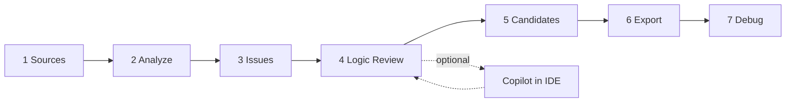

# Design Plan: PM Test Spec Assistant + Copilot in the Loop

**Status:** Design-first (v0.3 target) — superseded in part by `ALEX_M365_REASONING_UPGRADE_PLAN.md` for M365 API integration and complex-spec reasoning.  
**Audience:** Automotive system / test engineers  
**Principle:** Deterministic tool owns structure and evidence; Copilot owns interpretation and gaps.

---

## 1. Problem statement

| Layer | Role today | Gap |
|-------|------------|-----|
| **This tool** | Parse Word/Excel tables, build AST, issues, Excel export | Cannot fully understand design intent, diagrams, or ambiguous prose |
| **Engineer** | Final approval | Too much manual hunting across tabs |
| **Copilot (IDE)** | Strong at reading specs, explaining design, drafting text | Must not become source of truth for logic structure |

**Goal:** A closed loop where the engineer reviews **once per control** in Logic Review, uses Copilot for what the parser cannot safely infer, and exports Excel only when issues are understood.

---

## 2. Design principles (best practice)

1. **Deterministic core, probabilistic assist** — Parser + issue collector decide structure; Copilot only suggests.
2. **Fail closed** — Unknown logic → issue + blocked candidates, never silent TRUE/FALSE.
3. **Single review surface** — Logic Review page = source table + tree + expression + issues + candidates.
4. **Excel is the contract** — YAML/MD for debug only.
5. **Copilot reads the same evidence** — Export `review_package.xlsx` + `ui_bundle.yaml` + issue list as Copilot context, not chat memory.
6. **Human signs off** — No auto-approve; engineer marks reviewed or edits in Excel.

---

## 3. Target workflow (7 UI steps)



| Step | Tool responsibility | Copilot responsibility |
|------|---------------------|------------------------|
| **Sources** | Classify files, selectable ingest set | Suggest which files are spec vs reference |
| **Analyze** | Run deterministic pipeline | — |
| **Issues** | List blockers first (errors, no export) | Explain issue impact in plain language |
| **Logic Review** | Table + AST + parser_reason | Explain design intent, validate tree vs spec narrative |
| **Candidates** | Show blocked vs allowed, descriptions | Improve test wording (Given/When/Then) |
| **Export** | Download 4 Excel workbooks | Review export for completeness vs customer template |
| **Debug** | Log, ui_bundle, review MD | Diagnose parse failures |

---

## 4. Copilot-in-the-loop architecture

### 4.1 Separation of concerns

```
┌─────────────────────────────────────────────────────────┐
│  PM Test Spec Assistant (deterministic)                 │
│  • Table detection, AST, footnotes, aliases, constants  │
│  • Issues with source + parser_reason                   │
│  • Excel export + traceability                          │
└───────────────────────┬─────────────────────────────────┘
                        │ artifacts
                        ▼
┌─────────────────────────────────────────────────────────┐
│  Copilot context pack (read-only for Copilot)           │
│  • issue_list.xlsx                                      │
│  • logic_traceability.xlsx                              │
│  • review_package.xlsx (Two_Column_Rows, Logic_AST)   │
│  • Selected .docx/.xlsx source files                    │
│  • docs/COPILOT_PROMPTS.md (standard prompts)           │
└───────────────────────┬─────────────────────────────────┘
                        │ suggestions (review_required)
                        ▼
┌─────────────────────────────────────────────────────────┐
│  Engineer decision                                      │
│  • Confirm / override in UI or Excel                    │
│  • Never paste Copilot tree as final without check      │
└─────────────────────────────────────────────────────────┘
```

### 4.2 What Copilot must **not** do

- Invent final AND/OR/NOT structure without citing table rows.
- Resolve `unresolved_condition` without a definition source.
- Approve blocked candidates for export.

### 4.3 What Copilot **should** do (high value)

| Task | Input | Output | Stored as |
|------|--------|--------|-----------|
| Design summary | Word spec + diagram images | 1-page control overview | `llm_design_note` (review only) |
| Japanese → EN | `japanese_interpretations` | Translation + technical gloss | existing JP pipeline |
| Issue explanation | `issue_list.xlsx` row | Plain-language impact + action | comment in review MD |
| Test description | Candidate + logic path | Improved Given/When/Then | `improvement_suggestion` |
| Diagram | Image / narrative | Proposed transitions (unverified) | `diagram_interpretation_review_required` |

All Copilot outputs: `source_type: llm_generated`, `review_required: true`, `confidence: low|medium`.

### 4.4 Standard Copilot prompts (to add in repo)

File: `docs/COPILOT_PROMPTS.md` (future)

1. *"Given `logic_traceability.xlsx` and the Word table for control X, does the AST match the author's intent? List mismatches only."*
2. *"Explain issue ERR_REF_003 for a test engineer; do not change logic."*
3. *"Draft test case description from logic path row TC_PM_012; cite source file and table."*

---

## 5. Tool roadmap (phased)

### Phase A — Stabilize (current sprint)

- [x] 6-step UI + Debug page
- [x] File selection checkboxes + save + analyze selected only
- [x] Export URL fix + download with error feedback
- [x] Generic indentation/column AST parser
- [ ] Copilot context pack script (`scripts/build_copilot_context.sh`)

### Phase B — Copilot integration (lightweight)

- [ ] `copilot_context/` folder per job: zip of xlsx + yaml + excerpt MD
- [ ] "Copy Copilot brief" button on Logic Review (markdown snippet per control)
- [ ] Optional: paste Copilot note back into `engineer_note` field (UI)

### Phase C — Quality

- [ ] More parser unit tests (footnote, alias, Word vs Excel same grid)
- [ ] Diagram: structured narrative only; optional vision via Copilot manual step
- [ ] Customer Excel template mapping layer

### Phase D — Optional automation

- [ ] Cursor rule / `.github/copilot-instructions.md` pointing to this design
- [ ] CI: pytest + sample spec regression on `edited_Shutoff` + 2 other fixtures

---

## 6. Logic Review page (canonical UX)

For each **control** one card:

| Section | Content |
|---------|---------|
| A | Excel-like source rows (type, depth, parser_reason) |
| B | Visual tree (AND/OR/NOT colors) |
| C | Expression (secondary to tree) |
| D | Source evidence (file, table, row) |
| E | Issues (linked, blocks export) |
| F | Candidates (only if `can_generate_candidates`) |

**Copilot hook:** Button "Open Copilot brief" copies structured prompt + table excerpt to clipboard.

---

## 7. Issue → export policy

| Severity | can_export default | Copilot role |
|----------|-------------------|--------------|
| error + parse failed | false | Explain; do not fix silently |
| error + unresolved ref | false (strict) | Find definition in spec |
| warning | true with review | Clarify ambiguity |
| info (continuation row) | true | Optional note |

---

## 8. Acceptance criteria (release)

1. Engineer understands **one control** on Logic Review without other tabs.
2. File selection persists and limits analyze set.
3. Export downloads work or show clear error (missing xlsx).
4. Debug shows job log + ui_bundle.
5. Copilot brief documented; engineer knows what to ask Copilot vs the tool.
6. No sample-specific signal names in parser code paths.

---

## 9. Immediate fixes applied (this change)

| Bug | Cause | Fix |
|-----|-------|-----|
| Files not selectable | UI refactor removed checkboxes | Restored checkboxes + `/api/files/select` |
| Export 404 | Wrong API paths in frontend | Correct paths + backend aliases + fetch download |
| Debug broken | No ui-bundle route | `GET /api/export/ui-bundle` + Debug page |

---

## 10. How to use Copilot today (manual loop)

1. Run analysis in web UI through **Issues** → fix blockers you can.
2. **Export** all four Excel files.
3. Open spec `.docx` + `issue_list.xlsx` + `logic_traceability.xlsx` in IDE.
4. Ask Copilot: *"Using the Logic_AST sheet and the Word table for SHUTOFF_DECISION, validate the parsed tree and list gaps."*
5. Return to **Logic Review**; adjust engineering judgment; re-export if needed.

This loop keeps **Copilot as design assistant** and the **tool as evidence engine**.
